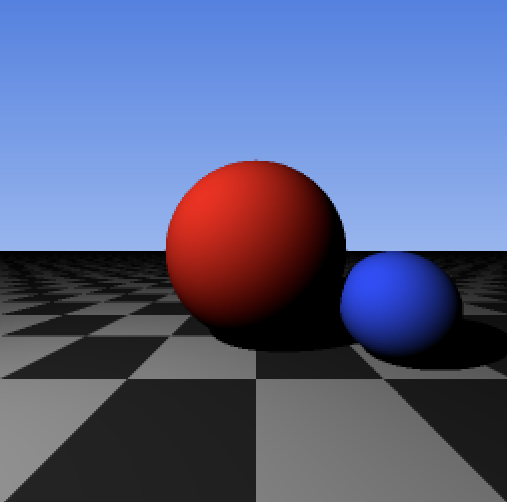

# CPU Ray Tracer

A small CPU ray tracer written from scratch in C++ to learn the foundations of
3D rendering, vector mathematics, numerical intersection tests, lighting, and
secondary rays. The renderer does not use OpenGL or an external graphics
library; it calculates every pixel on the CPU and writes the result as a PPM
image.

## Final Render



The scene contains two colored spheres resting on a procedurally generated
checkerboard ground plane beneath an interpolated blue sky. A point light
provides Lambertian diffuse illumination, and secondary rays create hard cast
shadows. Each output pixel is averaged from a 2x2 grid of camera-ray samples.

## Features

- Plain-text PPM (`P3`) image output
- Reusable three-component vector type
- Vector addition, subtraction, scalar multiplication, dot products, length,
  and normalization
- Configurable pinhole camera with a viewport and focal length
- Ray evaluation using `P(t) = O + tD`
- Analytical ray-sphere intersections using the quadratic formula
- Analytical ray-plane intersections
- Multiple colored spheres with closest-hit selection
- Procedural checkerboard ground material generated from world-space hit points
- Outward-facing sphere normals and a constant plane normal
- Lambertian diffuse lighting from a point light
- Distance-limited shadow rays with a surface-origin offset
- Interpolated blue sky background
- Deterministic 2x2 supersampling antialiasing

## Mathematics

### Rays

A ray is represented by an origin `O`, a direction `D`, and a parameter `t`:

```text
P(t) = O + tD
```

Positive values of `t` move forward along the ray. The renderer chooses the
smallest positive intersection so that only the closest visible surface is
shaded.

### Ray-sphere intersection

A point lies on a sphere with center `C` and radius `r` when:

```text
(P - C) dot (P - C) = r^2
```

Substituting the ray equation and defining `oc = O - C` produces a quadratic:

```text
a = D dot D
b = 2(oc dot D)
c = oc dot oc - r^2

a(t^2) + bt + c = 0
```

The discriminant determines whether the ray misses, touches, or crosses the
sphere:

```text
discriminant = b^2 - 4ac
```

When an intersection exists, the renderer evaluates both roots and returns the
nearest positive one.

### Ray-plane intersection

The ground plane is represented by a point `Q` and a normal `N`. Its
intersection parameter is:

```text
t = ((Q - O) dot N) / (D dot N)
```

When `D dot N` is close to zero, the ray is parallel to the plane and no unique
intersection is returned.

### Surface normals and lighting

The outward sphere normal at a hit point `P` is:

```text
N = normalize(P - C)
```

Lambertian diffuse intensity measures the alignment between the surface normal
and the normalized direction `L` toward the light:

```text
intensity = max(0, N dot L)
finalColor = baseColor * intensity
```

For shadows, the renderer starts a secondary ray slightly above the surface:

```text
shadowOrigin = P + epsilon * N
```

The point is shadowed when a sphere intersects that ray at a positive distance
smaller than the distance to the light.

### Camera coordinates

The camera looks toward negative `z`. World `x` increases to the right and
world `y` increases upward, while image rows increase downward. Normalized image
coordinates `(u, v)` are mapped onto the viewport with:

```text
viewportX = (u - 0.5) * viewportWidth
viewportY = (0.5 - v) * viewportHeight
```

### Procedural materials and sky

The checkerboard ground pattern is generated without image textures. The
floored world-space `x` and `z` coordinates of a plane hit determine whether the
point uses the light or dark square color:

```text
checkerIndex = floor(Px) + floor(Pz)
```

Even and odd indices alternate the square color before Lambertian lighting and
shadows are applied.

The background uses linear interpolation between a pale horizon color and a
deeper blue top color:

```text
skyColor = (1 - t) * horizonColor + t * topColor
```

## Build and Run

The project requires a C++17-compatible compiler and has no external
dependencies.

```bash
g++ -std=c++17 -O2 -Wall -Wextra -Wpedantic main.cpp -o raytracer
./raytracer
```

Running the program creates `output.ppm` in the current directory. On macOS,
open it with:

```bash
open output.ppm
```

To create a PNG for the README on macOS:

```bash
sips -s format png output.ppm --out render.png
```

## Project Structure

```text
Ray_Tracing/
├── main.cpp      # Vector math, geometry, camera, shading, and render loop
├── README.md     # Project documentation
├── render.png    # Portfolio-friendly preview of the final render
└── output.ppm    # Image generated by the renderer
```

The implementation currently remains in one source file so the complete
rendering pipeline can be followed from camera-ray generation through final
pixel output.

## What I Learned

- How pixel coordinates map to points on a camera viewport
- How points and directions can share a vector representation while retaining
  different geometric meanings
- How dot products describe vector alignment and support both intersections and
  diffuse lighting
- How substituting a ray into a sphere equation creates a quadratic
- Why renderers select the nearest positive intersection
- How surface normals control diffuse brightness
- How secondary rays determine light visibility and create shadows
- Why a small normal offset is necessary to prevent floating-point
  self-intersection artifacts
- How multiple subpixel samples reduce jagged edges
- How world-space coordinates can generate procedural surface patterns
- How linear interpolation creates a smooth sky gradient
- How numerical types, operation order, and explicit conversions affect a
  renderer's correctness
